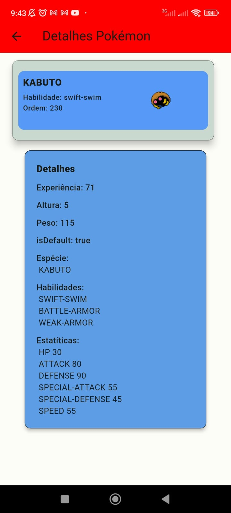

# PokeCapture App
Bem-vindo ao PokeCapture, um emocionante aplicativo Flutter com integração a banco de dados que permite a captura de pokémons usando a Poke API. Este projeto foi desenvolvido como parte de um trabalho acadêmico em dupla com [Giovanna Oliveira](https://github.com/giovannaoliveira). Com uma interface amigável e recursos interativos, este aplicativo proporciona uma experiência única para os treinadores pokémon.

### Funcionalidades
#### 1. Captura de Pokémons
Toque na tela para encontrar e capturar pokémons selvagens.
A Poke API fornece uma variedade de espécies de pokémons para você explorar.
#### 2. Meus Pokémons
Na aba "Meus Pokémons", visualize todos os pokémons capturados.
Diferencie entre um toque simples e um toque prolongado para acessar diferentes funcionalidades.
#### 3. Detalhes do Pokémon
Toque prolongado em um pokémon na aba "Meus Pokémons" para visualizar detalhes específicos do pokémon.
Obtenha informações sobre habilidades, estatísticas e outros dados relevantes.
#### 4. Soltar Pokémon
Toque simples em um pokémon na aba "Meus Pokémons" para acessar a opção de soltar o pokémon.
Confirme a liberação do pokémon para liberar espaço e continuar capturando mais.

Configuração do Projeto
#### 1. Clone este repositório:
````
  git clone https://github.com/seu-usuario/pokecapture.git
````

#### 2. Navegue até o diretório do projeto:
````
  cd pokemon_app
````

#### 3. Execute o aplicativo no seu dispositivo ou emulador:
````
  flutter run
````
# Imagens
## 1. Tela inicial


## 2. Abas da tela inicial


## 3. Pokémons capturados
   

## 4. Detalhes do Pokémon


## 5. Capturar Pokémon


## 6. Capturar Pokémon (icone muda quando captura um pokémon)


## 7. Capturar Pokémon (não dá pra pegar o mesmo pokémon duas vezes)


## 8. Soltar Pokémon


## 9. Detalhes dos desenvolvedores


